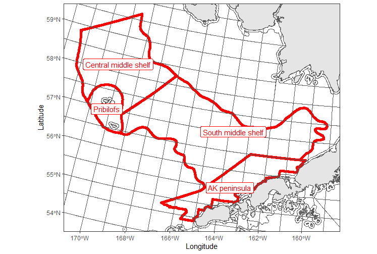

## Compare chlorophyll product

For each region I compare chlorophyll value (raw and scaled), the effects of depth filters(MODIS and OC-CCI only), and record counts between chlorophyll products.


**Create function for joining and plotting MODIS and OC indicators over time**

```{r, warning=FALSE, message=FALSE}
library(tidyverse)
library(lubridate)
library(sf)
library(AKmarineareas)


#scale values
range01 <- function(x){(x-min(x, na.rm=T))/(max(x, na.rm=T)-min(x, na.rm=T))}

#join aggregated products
chla_join<-function(w,x,y,z, aa){
  w%>%left_join(x, by=c("YEAR"="YEAR"))%>%
    left_join(y, by=c("YEAR"="YEAR"))%>%
    left_join(z, by=c("YEAR"="YEAR"))%>%
    left_join(aa, by=c("YEAR"="YEAR"))%>%
    mutate(#OCCCI_S=scale(OCCCI_VALUE_NF, center=FALSE, scale=FALSE),
           #MODIS_S=scale(MODIS_VALUE_NF, center=FALSE, scale=FALSE),
           OCCCI_S=range01(OCCCI_VALUE_NF),
           MODIS_S=range01(MODIS_VALUE_NF),
           VIIRS_S=range01(VIIRS_VALUE))
}

#time series of the three products
chla_timeplot<-function(x, indicator) {
  ggplot()+
  geom_line(data=x, aes(x=YEAR,y=OCCCI_VALUE_NF), color="red")+
  geom_line(data=x, aes(x=YEAR,y=MODIS_VALUE_NF), color="blue")+
  geom_line(data=x, aes(x=YEAR,y=VIIRS_VALUE), color="green")+
  ylab("chla")+
    ylim(c(0,5))+
  ggtitle(paste(indicator, "\n OC-CCI=red, MODIS=blue, VIIRS=green"))
}

#time series with depth filters and no depth filters
chla_timeplot_depth<-function(x, indicator) {
  ggplot()+
  geom_line(data=x, aes(x=YEAR,y=OCCCI_VALUE_NF), color="red")+
  geom_line(data=x, aes(x=YEAR,y=OCCCI_VALUE_F), color="red", lty=2)+
  geom_line(data=x, aes(x=YEAR,y=MODIS_VALUE_NF), color="blue")+
  geom_line(data=x, aes(x=YEAR,y=MODIS_VALUE_F), color="blue", lty=2)+
  ylab("chla")+
    ylim(c(0,5))+
  ggtitle(paste(indicator, "\n OC-CCI=red, MODIS=blue, dashed=depth filtered"))
}

#scaled timeseries
chla_scale<-function(x, indicator) {
  ggplot()+
  geom_line(data=x, aes(x=YEAR,y=OCCCI_S), color="red")+

  geom_line(data=x, aes(x=YEAR,y=MODIS_S), color="blue")+
 geom_line(data=x, aes(x=YEAR,y=VIIRS_S), color="green")+
  ylab("scaled chla")+
  ggtitle(paste(indicator, " OC-CCI=red, MODIS=blue"))
}

#count plot
count_plot<-function(x, indicator) {
  ggplot()+
      geom_col(data=x, aes(x=YEAR,y=VIIRS_N), fill="green")+
  geom_col(data=x, aes(x=YEAR,y=OCCCI_N), fill="red")+
  geom_col(data=x, aes(x=YEAR,y=MODIS_N), fill="blue")+

  ylab("scaled chla")+
  ggtitle(paste(indicator, " OC-CCI=red, MODIS=blue, VIIRS=green"))
}


```

## SEBS
I first look at the BSIERP "super region" consisting of the South Middle shelf, Alaska Peninsula, Pribilofs, and Central Middle Shelf regions.



**load data**
*modis*
MODIS data were downloaded from a google folder where Jordan stored them from previous efforts https://drive.google.com/drive/u/1/folders/1mhwQ70mjLrkiQYiQ2oNHx08Q7IlL8Q3-

*oc-cci*
This took a couple hundred lines of codes to make, found in chla-indicator-comparison-data.Rmd

*viirs*
in chla-indicator-comparison-data.Rmd
Lookup table code on sharefile Personal folders>projects>chlorophyll... 
```{r}
#MODIS
mod_ebs<-readRDS("Data/MODIS/merged_8day_2003_2021_EBS.RDS")
#occci
occ_ebs<-readRDS("Data/OCCCI/occ8_strata_ebs.RDS")
#viirs
viirs<-readRDS("Data/VIIRS/viirs_strata.RDS")
```

**Compare products**

```{r, warning=FALSE, message=FALSE}
#define indicator
indicator<-"BSIERP middle shelf regions"

#MODIS with a 50-200 depth filter and limited to federal waters. 
mod_esr_df<-mod_ebs%>%
  mutate(month=month(date),
         YEAR=year(date),
         ) %>%
  filter(bsierp_id %in% c(1,3,5,6) & month %in% c(4,5,6) & depth <(-50) & depth>(-200) & statefed == "FED"
         )%>%
  group_by(YEAR)%>%
  summarise(MODIS_VALUE_F=round(mean(chlorophyll, na.rm=T),2))

#no depth filter
mod_esr_ndf<-mod_ebs%>%
  mutate(month=month(date),
         YEAR=year(date),
         ) %>%
  filter(bsierp_id %in% c(1,3,5,6) & month %in% c(4,5,6) #& depth <(-50) & depth>(-200)
         )%>%
  group_by(YEAR)%>%
  summarise(MODIS_VALUE_NF=round(mean(chlorophyll, na.rm=T),2),
            MODIS_N=n())


#oc-cci depth filter
occci_esr_df<-occ_ebs%>%
  filter(BSIERP_ID %in% c(1,3,5,6) & month %in% c(4,5,6) & depth <(-50) & depth>(-200) & WATERS_COD== "FED"
         )%>%
  mutate(YEAR=year) %>%
  group_by(YEAR)%>%
  summarise(OCCCI_VALUE_F=round(mean(chlorophyll, na.rm=T),2))

#oc-cci no depth filter
occci_esr_ndf<-occ_ebs%>%
  filter(BSIERP_ID %in% c(1,3,5,6) & month %in% c(4,5,6) #& depth <(-50) & depth>(-200)
         )%>%
  mutate(YEAR=year) %>%
  group_by(YEAR)%>%
  summarise(OCCCI_VALUE_NF=round(mean(chlorophyll, na.rm=T),2),
            OCCCI_N=n())

#viirs
#oc-cci no depth filter
viirs_bsierp<-viirs%>%
  filter(BSIERP_ID %in% c(1,3,5,6) & month %in% c(4,5,6) #& depth <(-50) & depth>(-200)
         )%>%
  mutate(YEAR=year) %>%
  group_by(YEAR)%>%
  summarise(VIIRS_VALUE=round(mean(chlorophyll, na.rm=T),2),
            VIIRS_N=n())

#join
bsierp<-chla_join(occci_esr_ndf, occci_esr_df, mod_esr_ndf, mod_esr_df, viirs_bsierp)

#plot timeseries
chla_timeplot(bsierp, indicator)

#plot depth filter differences
#plot timeseries
chla_timeplot_depth(bsierp, indicator)

#how much was filtered out?
#mod_ebs%>%
#  mutate(month=month(date) ) %>%
#  filter(bsierp_id %in% c(1,3,5,6) & month %in% c(4,5,6))%>%
#    summarise(no_filter=n())%>%
#  bind_cols(mod_ebs %>%
#              mutate(month=month(date) ) %>%
#  filter(bsierp_id %in% c(1,3,5,6) & month %in% c(4,5,6) & depth <(-50) & depth>(-200) & statefed == "FED")%>%
#  summarise(depth_filter=n())) %>% 
#  mutate(percent_remaining=depth_filter/no_filter*100)
#<12% removed by filter... didn't make much of a difference here.

#plot scaled
chla_scale(bsierp, indicator)

#barplot
count_plot(bsierp, indicator)

```

*compare modis record counts*
This is to check whether the 2020 and later record counts result from our MODIS file inadvertently missing some data or if there are really way fewer records. 

Unfortunately it demonstrates that the MODIS files previously used were missing ~50% of the data. While this should certainly be corrected in future products, the missing data are spread evenly throughout space, and affects on indicator values, aggregated over large areas, will likely be minimal. 

```{r}
#compare newly downloaded MODIS with mod_esr_ndf 
#value and record counts for 2020
mod_2020_bsierp<-readRDS("Data/MODIS/mod_2020_bs_strata.RDS")%>%
  mutate(YEAR=year(date),
         ) %>%
  filter(BSIERP_ID %in% c(1,3,5,6) & month %in% c(4,5,6) #& depth <(-50) & depth>(-200)
         ) %>%
  group_by(YEAR)%>%
  summarise(MODIS_VALUE_recalc=round(mean(chlorophyll, na.rm=T),2),
            MODIS_N_recalc=n())


mod_2020_bsierp%>%inner_join(mod_esr_ndf%>%rename(c("MODIS_VALUE_ESP"="MODIS_VALUE_NF", "MODIS_N_ESP"="MODIS_N")), by="YEAR")

#huh, the value is the same but we're missing a lot of values in our existing file.
#filter to BSIERP regions and year=2020
mod_old<-mod_ebs%>%
  mutate(month=month(date),
         year=year(date),
         ) %>%
  filter(bsierp_id %in% c(1,3,5,6) & month %in% c(4,5,6) & year==2020)


mod_new<-readRDS("Data/MODIS/mod_2020_bs_strata.RDS")%>%
  mutate(YEAR=year(date),
         date=as.Date(date)
         ) %>%
  filter(BSIERP_ID %in% c(1,3,5,6) & month %in% c(4,5,6) #& depth <(-50) & depth>(-200)
         )
#New one has twice as many values...
mod_old%>%
  group_by(date)%>%
  summarise(N_old=n())%>%
  inner_join(mod_new%>%
  group_by(date)%>%
  summarise(N_new=n()), by="date")

#any NAs in the new?
any(is.na(mod_new$chlorophyll))
#No....

#let's plot them in one region
ggplot()+
  geom_point(data=mod_new%>%filter(date=="2020-06-05" & BSIERP_ID=="5"), aes(x=longc, y=latc), color="red")+
  geom_point(data=mod_old%>%filter(date=="2020-06-05" & bsierp_id==5), aes(x=longitude, y=latitude), color="black")

#unfortunately the MODIS date previously used for ESPs inadvertently excluded some data. 
#Fortunately the aggregated value was unaffected. 
```

*Demonstrate integrity of other products*
OC-CCI and viirs don't have the skipped data that the 2020 MODIS files had. Nor do the 2019 (and presumably earlier) MODIS files. Those lookup tables can be tricky...
```{r}
#occci
occci_bsierp_5<-occ_ebs%>%
  mutate(date=as.Date(date))%>%
  filter(BSIERP_ID ==5 & date=="2020-06-01")

ggplot()+
  geom_point(data=mod_new%>%filter(date=="2020-06-05" & BSIERP_ID=="5"), aes(x=longc, y=latc), color="red")+
  geom_point(data=occci_bsierp_5, aes(x=longc, y=latc), color="black")

#Nice OC-CCI looks good.

#VIIRS
#occci
viirs_bsierp_5<-viirs%>%
  mutate(date=as.Date(date))%>%
  filter(BSIERP_ID ==5 & year==2020)

ggplot()+
  #geom_point(data=mod_new%>%filter(date=="2020-06-05" & BSIERP_ID=="5"), aes(x=longc, y=latc), color="red")+
  geom_point(data=viirs_bsierp_5%>%filter(date=="2020-05-27"), aes(x=longitude, y=latitude), color="black")
#VIIRS also looks good

#MODIS in 2019

mod_2019<-mod_ebs%>%
  mutate(month=month(date),
         year=year(date),
         ) %>%
  filter(bsierp_id ==5  & year==2019)

ggplot()+
  geom_point(data=mod_2019%>%filter(date=="2019-05-29"), aes(x=longitude, y=latitude), color="black")


```


**Spring_Chlorophylla_Biomass_EGOA_Satellite**

```{r}
rm(mod_ebs);rm(occ_ebs)
mod_goa<-readRDS("Data/MODIS/merged_8day_2003_2021_GOA.RDS")

occ_goa<-readRDS("Data/OCCCI/occ8_strata_goa.RDS")

```

```{r, warning=FALSE, message=FALSE}
ak<-AK_basemap()
nmfs<-AK_marine_area()%>%filter(NMFS_REP_AREA>600)

ggplot()+
  geom_sf(data=ak)+
  geom_sf(data=nmfs, fill=NA, size=1, color="black")+
  geom_sf_label(data=nmfs, aes(label=NMFS_REP_AREA))+
  xlab("")+ylab("")+
  coord_sf(xlim=c(-170, -130), ylim=c(49, 63))+
  theme_bw()

```

```{r, warning=FALSE, message=FALSE}
#define indicator
indicator<-"Spring_Chlorophylla_Biomass_EGOA_Satellite"
#MODIS
#recalculate indicator
mod_EGOA_10 <- mod_goa %>%
  mutate(month=month(date),
         YEAR=year(date)) %>%
  filter(nmfsarea %in% c(640,650) & month%in% c(4:6) & depth<(-10) & depth>(-200)) %>%
  group_by(YEAR) %>%
  summarise(MODIS_VALUE_NF=mean(chlorophyll,na.rm=TRUE),
            MODIS_N=n())

#50m filter
mod_EGOA_50 <- mod_goa %>%
  mutate(month=month(date),
         YEAR=year(date)) %>%
  filter(nmfsarea %in% c(640,650) & month%in% c(4:6) & depth<(-50) & depth>(-200) & statefed=="FED") %>%
  group_by(YEAR) %>%
  summarise(MODIS_VALUE_F=mean(chlorophyll,na.rm=TRUE))


#OCC
occci_EGOA_10<-occ_goa%>%
  filter(NMFS_REP_AREA%in% c(640, 650) & month %in% c(4:6) & depth<(-10) & depth>(-200))%>%
   mutate(YEAR=year) %>%
  group_by(YEAR)%>%
  summarise(OCCCI_VALUE_NF=mean(chlorophyll,na.rm=TRUE),
            OCCCI_N=n())

occci_EGOA_50<-occ_goa%>%
  filter(NMFS_REP_AREA%in% c(640, 650) & month %in% c(4:6) & depth<(-50) & depth>(-200) & WATERS_COD== "FED")%>%
 mutate(YEAR=year) %>%
  group_by(YEAR)%>%
  summarise(OCCCI_VALUE_F=mean(chlorophyll,na.rm=TRUE))

#VIIRS
VIIRS_EGOA<-viirs%>%
  filter(NMFS_REP_AREA%in% c(640, 650) & month %in% c(4:6) & depth<(-10) & depth>(-200))%>%
   mutate(YEAR=year) %>%
  group_by(YEAR)%>%
  summarise(VIIRS_VALUE=mean(chlorophyll,na.rm=TRUE),
            VIIRS_N=n())

#plot
egoa<-chla_join(occci_EGOA_10, occci_EGOA_50, mod_EGOA_10, mod_EGOA_50, VIIRS_EGOA)

chla_timeplot(egoa, indicator)

chla_timeplot_depth(egoa, indicator)

#how much was filtered out?
#mod_goa%>%
#  mutate(month=month(date) ) %>%
#  filter(nmfsarea %in% c(640, 650) & month %in% c(4,5,6) & depth <(-10) & depth>(-200))%>%
#    summarise(ten_m_filter=n())%>%
#  bind_cols(mod_goa %>%
#              mutate(month=month(date) ) %>%
#  filter(nmfsarea %in% c(640, 650) & month %in% c(4,5,6) & depth <(-50) & depth>(-200) & statefed == "FED")%>%
#  summarise(fifty_m_filter=n())) %>% 
#  mutate(percent_remaining=fifty_m_filter/ten_m_filter*100)

#<14% removed by filter... didn't make much of a difference here.

#scale plot
chla_scale(egoa, indicator)

#count
#count_plot(egoa, indicator)
```

**Spring_Chlorophylla_Biomass_WCGOA_Satellite**

```{r, warning=FALSE, message=FALSE}
#define indicator
#define indicator
indicator<-"Spring_Chlorophylla_Biomass_WCGOA_Satellite"
#MODIS
#recalculate indicator
mod_WGOA_10 <- mod_goa %>%
  mutate(month=month(date),
         YEAR=year(date)) %>%
  filter(nmfsarea %in% c(610, 620, 630) & month%in% c(4:6) & depth<(-10) & depth>(-200)) %>%
  group_by(YEAR) %>%
  summarise(MODIS_VALUE_NF=mean(chlorophyll,na.rm=TRUE),
            MODIS_N=n())

#50m filter
mod_WGOA_50 <- mod_goa %>%
  mutate(month=month(date),
         YEAR=year(date)) %>%
  filter(nmfsarea %in% c(610, 620, 630) & month%in% c(4:6) & depth<(-50) & depth>(-200) & statefed=="FED") %>%
  group_by(YEAR) %>%
  summarise(MODIS_VALUE_F=mean(chlorophyll,na.rm=TRUE))

#OCC
occci_WGOA_10<-occ_goa%>%
  filter(NMFS_REP_AREA%in% c(610, 620, 630) & month %in% c(4:6) & depth<(-10) & depth>(-200))%>%
   mutate(YEAR=year) %>%
  group_by(YEAR)%>%
  summarise(OCCCI_VALUE_NF=mean(chlorophyll,na.rm=TRUE),
            OCCCI_N=n())

occci_WGOA_50<-occ_goa%>%
  filter(NMFS_REP_AREA%in% c(610, 620, 630) & month %in% c(4:6) & depth<(-50) & depth>(-200) & WATERS_COD== "FED")%>%
 mutate(YEAR=year) %>%
  group_by(YEAR)%>%
  summarise(OCCCI_VALUE_F=mean(chlorophyll,na.rm=TRUE))

#VIIRS
VIIRS_WGOA<-viirs%>%
  filter(NMFS_REP_AREA%in% c(610, 620, 630) & month %in% c(4:6) & depth<(-10) & depth>(-200))%>%
   mutate(YEAR=year) %>%
  group_by(YEAR)%>%
  summarise(VIIRS_VALUE=mean(chlorophyll,na.rm=TRUE),
            VIIRS_N=n())

#join
wgoa<-chla_join(occci_WGOA_10, occci_WGOA_50, mod_WGOA_10, mod_WGOA_50, VIIRS_WGOA)

#plot
chla_timeplot(wgoa, indicator)

chla_timeplot_depth(egoa, indicator)


#how much was filtered out?
#mod_goa%>%
#  mutate(month=month(date) ) %>%
#  filter(nmfsarea %in% c(610, 620, 630) & month %in% c(4,5,6) & depth <(-10) & depth>(-200))%>%
#    summarise(ten_m_filter=n())%>%
#  bind_cols(mod_goa %>%
#              mutate(month=month(date) ) %>%
#  filter(nmfsarea %in% c(610, 620, 630) & month %in% c(4,5,6) & depth <(-50) & depth>(-200) & statefed == "FED")%>%
#  summarise(fifty_m_filter=n())) %>% 
#  mutate(percent_remaining=fifty_m_filter/ten_m_filter*100)

#<19% removed by filter.

chla_scale(wgoa, indicator)
#count_plot(wgoa, indicator)
```